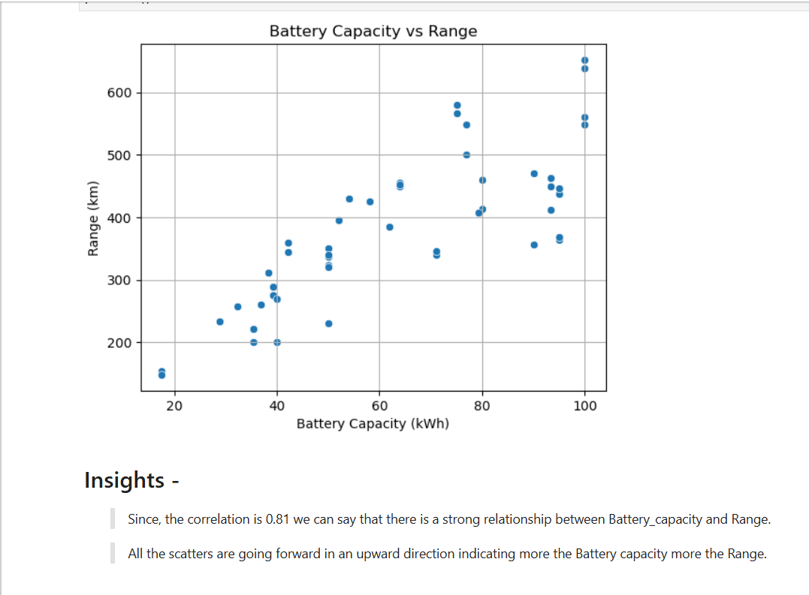
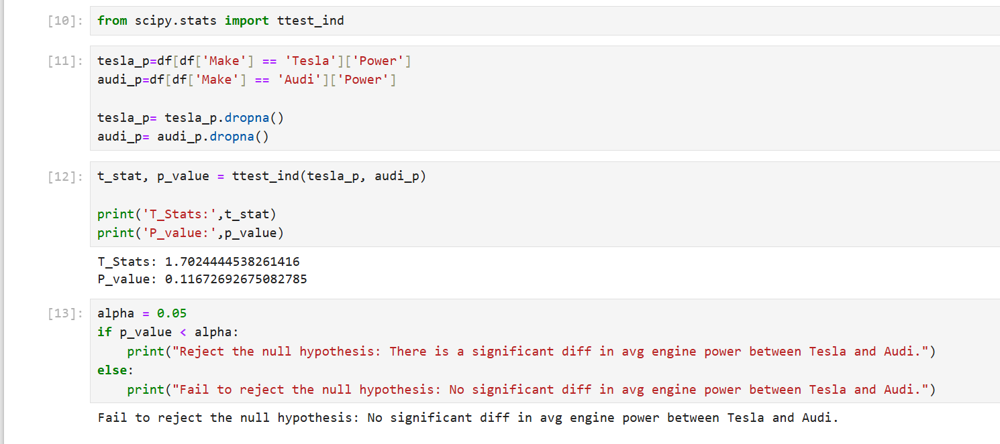
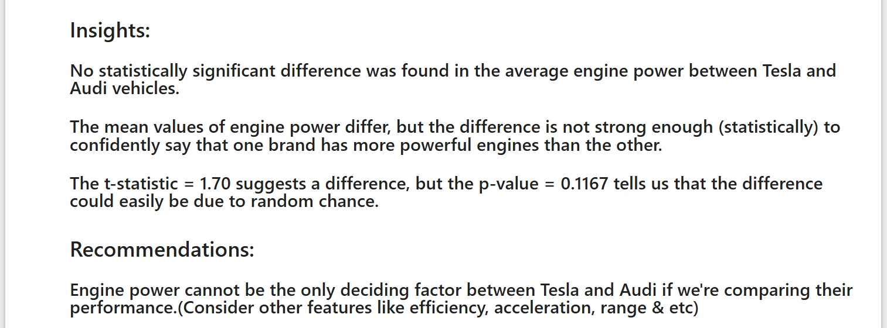

#  Electric Vehicle (EV) Data Analysis Project – Final Submission

##  Overview

This project explores a dataset of Electric Vehicles (EVs) to uncover insights into pricing, performance, energy consumption, and specifications. It combines **data analysis**, **visualization**, and **hypothesis testing** with a functional **EV recommendation system** built using Python.

---

##  Files Included

- `EV_Analysis.ipynb` – Main project notebook with code and analysis
- `FEV-data-Excel.xlsx` – The original dataset
- `Battery_vs_Range.png` – Plot showing battery capacity vs range
- `Hypothesis_testig.png` – Visual for hypothesis testing (Tesla vs Audi)
- `README.md` – Project documentation (this file)

---

## Dataset Summary

**Dataset:** `FEV.xlsx`

This dataset contains specifications for a wide range of electric vehicles, including:
-  Performance: Engine power, torque, acceleration
-  Electrical: Battery capacity, range, energy consumption
-  Cost: Gross price in PLN
-  Dimensions: Wheelbase, length, width, weight
-  Other: Drive type, brake type, number of seats/doors, tire size

---

##  Task Overview

### Task 1: Budget and Range Filtering
- Filter EVs under 350,000 PLN with ≥400 km range
- Group by manufacturer
- Calculate average battery capacity

### Task 2: Energy Consumption Outliers
- Identify outliers in energy consumption using IQR

### Task 3: Range vs Battery Capacity Visualization
- Scatter plot to analyze trends

### Task 4: EV Recommendation Class
- Input: Budget, range, battery capacity
- Output: Top 3 matching EVs based on filters

### Task 5: Hypothesis Testing – Engine Power
- Compare engine power between Tesla and Audi using a two-sample t-test

#  Tools & Libraries

- `pandas`, `numpy`, `scipy.stats`, `matplotlib`, `seaborn`
- `ttest_ind` for inferential statistics
- Jupyter Notebook

---

##  Insights & Recommendations

